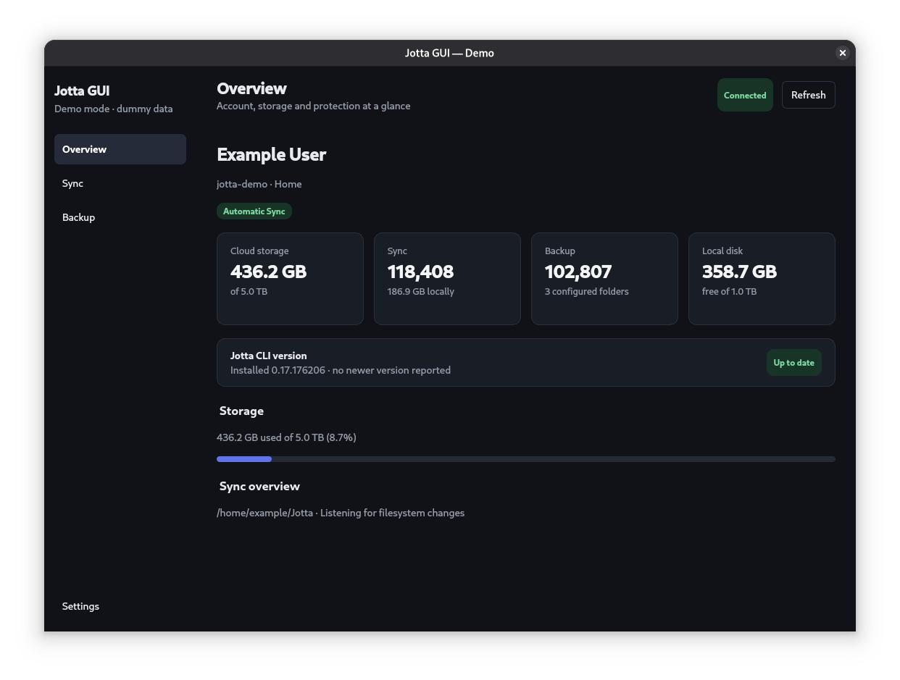
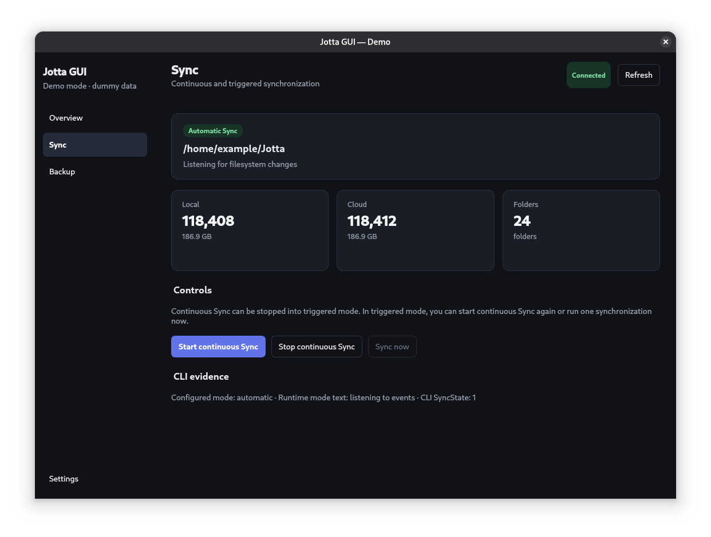
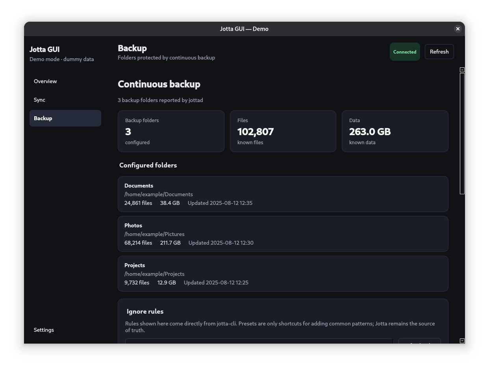
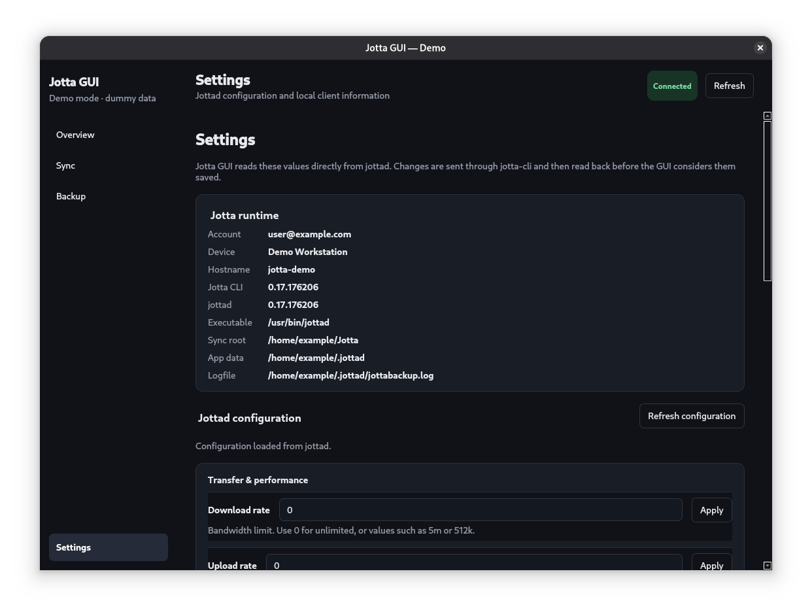

⚠️ ChatGPT was heavily used, this is an AI assisted repo ⚠️

# Jotta GUI

This is my playground to test and learn. I use ChatGPT to support me on this journey.
You are free to copy and play around on your own.

## Screenshots

### Overview



### Sync



### Backup and ignore rules



### Settings



## Requrements for trying
- Debian/Ubuntu based Distro 

```
sudo apt install ./jotta-gui_0.2.0_amd64.deb
```

## Requirements for devs
- python 3.13
- pyside6
- pytest
- [uv](https://github.com/astral-sh/uv) - for developers


### Run
```bash
uv run jotta-gui
```

### Testing

Run the full test suite:

```bash
uv run pytest
```
Demo mode, using dummy data

```bash
uv run jotta-gui --demo
```